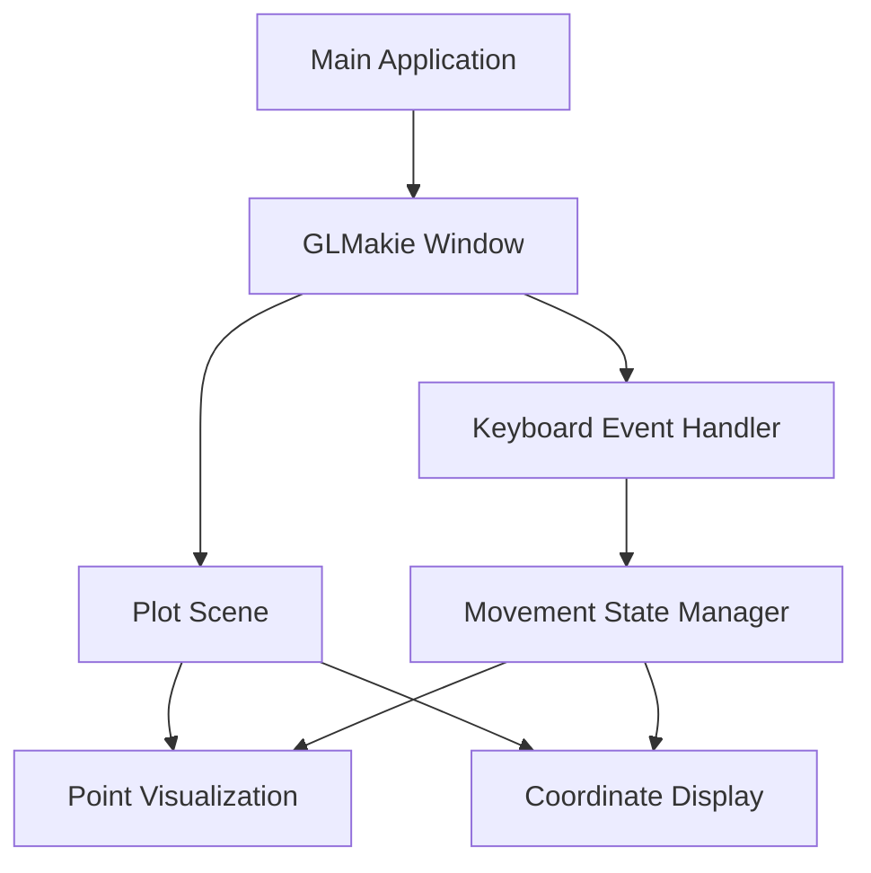

# Design Document

## Overview

The Julia Point Controller application will be built using GLMakie for visualization and real-time interaction. The application will create an interactive window where a point can be controlled using WASD keys with continuous movement while keys are held down. The design follows Julia best practices with a proper package structure and leverages GLMakie's event handling capabilities for keyboard input.

## Architecture

The application follows a simple event-driven architecture:

1. **Main Application Layer**: Initializes the GLMakie environment and sets up the main event loop
2. **Visualization Layer**: Manages the plot, point rendering, and coordinate display using GLMakie
3. **Input Handler Layer**: Processes keyboard events and updates point coordinates
4. **State Management**: Maintains current point position and movement state



## Components and Interfaces

### 1. Main Application Module (`PointController.jl`)
- **Purpose**: Entry point and application initialization
- **Responsibilities**:
  - Initialize GLMakie backend
  - Create and configure the main window
  - Set up the plot scene with axes
  - Start the event loop

### 2. Point Visualization Component
- **Purpose**: Render the controllable point and coordinate display
- **Key Elements**:
  - Observable point coordinates (x, y)
  - Scatter plot for point visualization
  - Text display for current coordinates
  - Axis configuration with proper scaling

### 3. Input Handler Component
- **Purpose**: Process keyboard events and manage movement state
- **Key Functions**:
  - `handle_key_press(key)`: Process key press events
  - `handle_key_release(key)`: Process key release events
  - `update_movement_state()`: Track which keys are currently pressed
  - `calculate_movement_vector()`: Determine movement direction based on active keys

### 4. Movement State Manager
- **Purpose**: Maintain current position and movement state
- **State Variables**:
  - `position::Observable{Point2f}`: Current point coordinates
  - `keys_pressed::Set{String}`: Currently pressed keys
  - `movement_speed::Float64`: Movement speed in units per frame
  - `is_moving::Bool`: Whether point is currently moving

## Data Models

### Point Position
```julia
# Using GLMakie's Point2f for coordinates
position = Observable(Point2f(0.0, 0.0))
```

### Movement State
```julia
mutable struct MovementState
    keys_pressed::Set{String}
    movement_speed::Float64
    last_update_time::Float64
end
```

### Key Mapping
```julia
const KEY_MAPPINGS = Dict(
    "w" => (0.0, 1.0),   # Up
    "s" => (0.0, -1.0),  # Down
    "a" => (-1.0, 0.0),  # Left
    "d" => (1.0, 0.0)    # Right
)
```

## Error Handling

### GLMakie Initialization Errors
- Check for OpenGL 3.3+ compatibility
- Provide clear error messages for graphics driver issues
- Fallback to software rendering if available

### Input Processing Errors
- Validate key codes before processing
- Handle simultaneous key press edge cases
- Graceful handling of window focus loss

### Performance Considerations
- Limit update frequency to prevent excessive CPU usage
- Use GLMakie's `render_on_demand` for efficient rendering
- Implement smooth movement with consistent frame timing

## Testing Strategy

### Unit Tests
1. **Movement Calculation Tests**
   - Test individual key mappings
   - Test diagonal movement combinations
   - Test movement speed calculations

2. **State Management Tests**
   - Test key press/release state tracking
   - Test position update logic
   - Test boundary conditions

### Integration Tests
1. **GLMakie Integration**
   - Test window creation and initialization
   - Test observable updates and plot refresh
   - Test keyboard event registration

2. **End-to-End Behavior**
   - Test complete key press to position update flow
   - Test multiple simultaneous key presses
   - Test smooth movement during continuous key hold

### Manual Testing
1. **Interactive Testing**
   - Verify smooth point movement in all directions
   - Test diagonal movement combinations
   - Verify coordinate display accuracy
   - Test application responsiveness

## Implementation Notes

### GLMakie Configuration
- Use `GLMakie.activate!()` with appropriate screen configuration
- Enable `render_on_demand = true` for performance
- Set reasonable `framerate = 60.0` for smooth movement

### Keyboard Event Handling
- Use GLMakie's event system for keyboard input
- Implement key state tracking to handle continuous movement
- Use timer-based updates for smooth animation

### Project Structure
```
PointController/
├── Project.toml
├── src/
│   ├── PointController.jl
│   ├── visualization.jl
│   ├── input_handler.jl
│   └── movement_state.jl
└── test/
    ├── runtests.jl
    ├── test_movement.jl
    └── test_input.jl
```